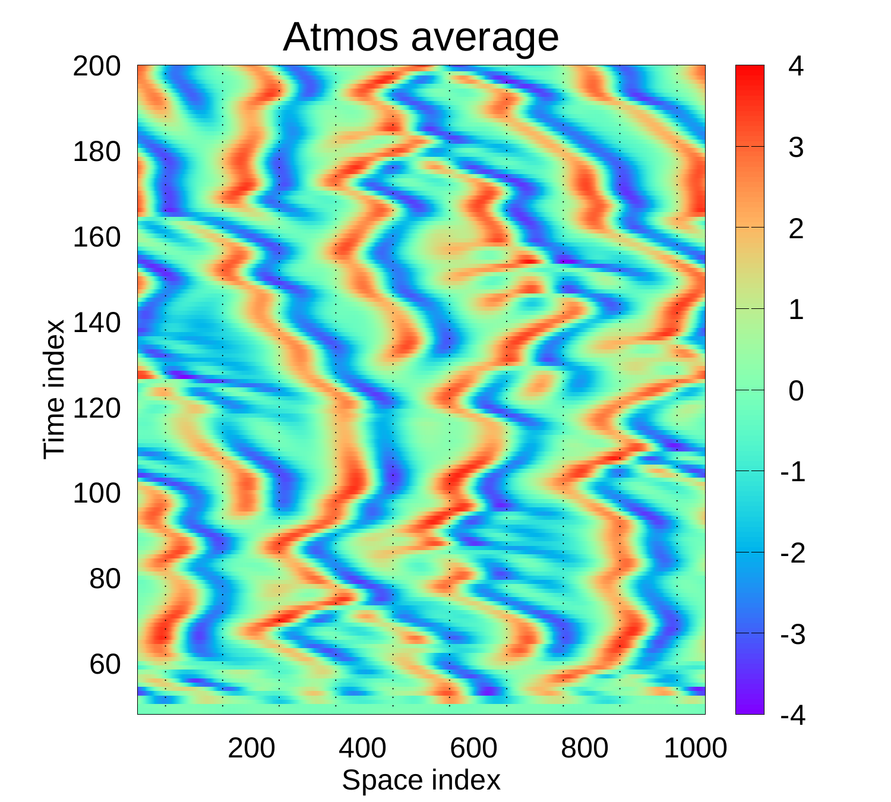
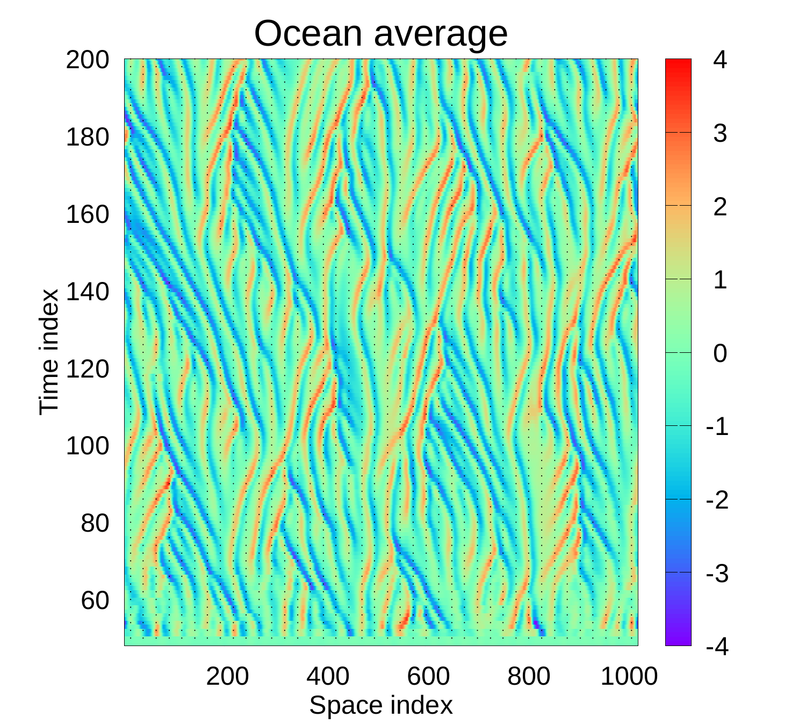

# EnKF_MS

Example of multiscale DA with the Kuramoto-Sivashinsky equations

<p align="center">


</p>

# Release notes
Note that this latest version (Nov 3, 2023 and onwards) needs an additional last line in infile.in defining the
time scale of the ocean model.  Check the test/infile.in for an example.

# MWR2023 code and cases
The original version of the code used for the MWR2023 paper is stored on the branch MWR2023.  After cloning the
repository you need to fetch it and check it out to replicate the cases in the paper as the main branch will
continue evolving and may become incosistent with the original input files.  Note that the existing seed.dat file
assumes gfortran.  The uncoupled DA experiments with separate updating requires a modified code stored in
the SeparateDA branch.

```bash
git fetch upstream MWR2023
git switch MWR2023
```
The input files and scripts needed to run the experiments reside in the mwr2023cases catalog


# Installation:

## 1. Building the Project

If you plan to collaborate or contribute anything to the project, use the <a href="#1b-advanced-installation">Advanced Installation</a> option.

### 1a. Basic installation

Create a directory to clone the three following repositories:

```bash
git clone git@github.com:geirev/EnKF_MS.git
git clone git@github.com:geirev/EnKF_analysis.git
git clone git@github.com:geirev/EnKF_sampling.git
```

After cloning, the directory structure should look like:

```bash
.
├── EnKF_analysis
├── EnKF_sampling
└── EnKF_MS
```

### 1b. Advanced installation

Make a personal github account unless you already have one.
Fork the three repositorys listed above.
Next clone the repositories and set upstream to the original repositories where
you need to replace <userid> with your github userid

```bash
git clone git@github.com:<userid>/EnKF_MS.git
pushd EnKF_MS
git remote add upstream https://github.com/geirev/EnKF_MS
#or, if you have set up git-ssh
#git remote add upstream git://github.com:geirev/EnKF_MS
popd

git clone git@github.com:<userid>/EnKF_analysis.git
pushd EnKF_analysis
git remote add upstream https://github.com/geirev/EnKF_analysis
#or, if you have set up git-ssh
#git remote add upstream git://github.com:geirev/EnKF_analysis
popd

git clone git@github.com:<userid>/EnKF_sampling.git
pushd EnKF_sampling
git remote add upstream https://github.com/geirev/EnKF_sampling
#or, if you have set up git-ssh
#git remote add upstream git://github.com:geirev/EnKF_sampling
popd
```

If you are new to Git, read the section <a href="https://github.com/geirev/EnKF_seir#git-instructions">Git instructions</a> but assume master
replaced with main.

## 2. Required Packages

### Linux

```bash
sudo apt update
sudo apt install libblas-dev liblapack-dev libomp-dev libfftw3-dev gfortran
sudo apt install gnuplot
sudo apt install ksh93u+m
```

### Mac

```bash
brew install gcc fftw openblas lapack
```

**Note:** You must have [Homebrew](https://brew.sh/) installed to install
packages using `brew`

## 3. Compile the `EnKF_sampling` library

Navigate to the `lib` folder of the `EnKF_sampling` repository:

```bash
cd EnKF_sampling/lib
```

then compile and place all the `.o` files as well as `libanalysis.a` into
the `build` directory of the `EnKF_MS` repository using:

```bash
make BUILD=../../EnKF_MS/build
```

## 4. Compile the `EnKF_analysis` library

Navigate to the `lib` folder of the `EnKF_analysis` repository:

```bash
cd EnKF_analysis/lib
```

then compile and place all the `.o` files as well as `libanalysis.a` into the
`build` directory of the `EnKF_MS` repository using:

```bash
make BUILD=../../EnKF_MS/build
```

**Note:** The `EnKF_analysis` repository depends on the `EnKF_sampling`
repository and therefore must be compiled second!

## 5. Compile the `EnKF_MS` library

### Linux

Navigate to the `src` folder of the `EnKF_MS` repository:

```bash
cd EnKF_MS/src
```

then compile and install the executable in the target directory, defaulting to
`$HOME/bin`:

```bash
make BINDIR=$HOME/bin
```

### Mac

Navigate to the `src` folder of the `EnKF_MS` repository:

```bash
cd EnKF_MS/src
```

then edit the following line in `EnKF_MS/src/makefile` from:

```bash
LIBS = ./libsampling.a ./libenkfanalysis.a -llapack -lblas -llapack /usr/lib/x86_64-linux-gnu/libfftw3.so.3
```

to:

```bash
LIBS = ./libsampling.a ./libenkfanalysis.a -llapack -lblas -llapack /usr/local/lib/libfftw3.a
```

then compile and install the executable in the target directory, defaulting to
`$HOME/bin`:

```bash
make BINDIR=$HOME/bin
```

## 6. Run the Project

### Linux

Navigate to the `test` directory of the `EnKF_MS` repository:

```bash
cd EnKF_MS/test
```

then run the project:
```bash
cd EnKF_MS/test
vi run.sh
./run.sh
```
edit the run.sh script to execute the code with the specified infiles.

### Mac

Create the `/usr/local/bin` directory which allows the `MS2` command to be ran
from anywhere on the local file system:

```bash
mkdir -p /usr/local/bin
```

then create a symlink for `$HOME/bin/multiscale` to `/usr/local/bin`

```bash
ln -s $HOME/bin/multiscale /usr/local/bin/
```

then run the project:
```bash
cd EnKF_MS/test
vi run.sh
./run.sh
```
edit the run.sh script to execute the code with the specified infiles.


## 7. Plotting
The run.sh script also generates plots using gnuplot.


## 8. Code standards
The code follows the standard  <a href="https://github.com/geirev/EnKF_seir#code-standards">Code standards</a>
